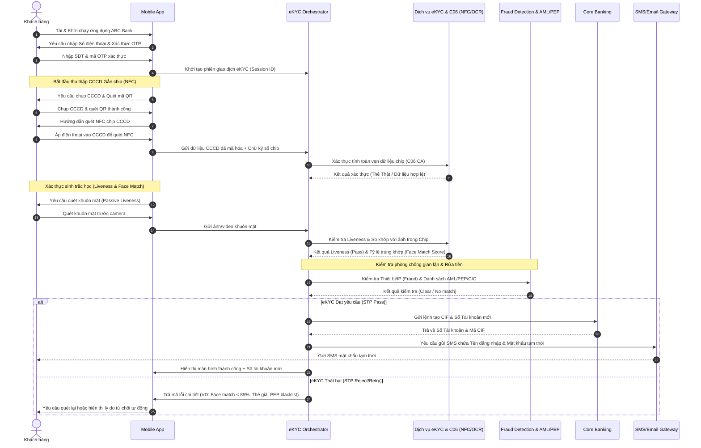

# PHÂN TÍCH YÊU CẦU NGHIỆP VỤ: SỐ HÓA QUY TRÌNH MỞ TÀI KHOẢN TRỰC TUYẾN QUA eKYC (ABC BANK)
### Mục tiêu chiến lược: Zero Manual Operation (Straight-Through Processing - STP 100%)

---

## 1. PHÂN TÍCH HỆ THỐNG (SYSTEM ANALYSIS)

### 1.1 Tác nhân (Actors)
Dưới đây là mô tả chi tiết toàn bộ các tác nhân tham gia vào hệ thống, bao gồm tác nhân con người (khách hàng) và các hệ thống, dịch vụ tự động hóa:

1. **Khách hàng (Customer / End-User)**:
   - Tác nhân chủ động thực hiện đăng ký mở tài khoản trực tuyến trên ứng dụng Mobile Banking của ABC Bank.
   - Cung cấp giấy tờ tùy thân, thực hiện quét sinh trắc học và nhập các thông tin bổ sung.

2. **Mobile Banking App (Client)**:
   - Ứng dụng di động của ABC Bank cài đặt trên thiết bị của khách hàng.
   - Thu thập thông tin từ camera (chụp ảnh CCCD, quét khuôn mặt), tương tác qua chip NFC và điều phối giao diện trực quan hướng dẫn khách hàng.

3. **Hệ thống Quản lý eKYC (eKYC Orchestrator / Gateway)**:
   - Hệ thống trung tâm điều phối toàn bộ quy trình nghiệp vụ eKYC.
   - Nhận dữ liệu từ Mobile App, gọi các dịch vụ thành phần (OCR, Liveness, Face Match, AML/PEP, Core Banking) theo kịch bản được định nghĩa trước và đưa ra quyết định duyệt/từ chối tự động.

4. **Dịch vụ OCR (OCR Engine)**:
   - Nhận diện ký tự quang học để trích xuất các thông tin văn bản từ hình ảnh giấy tờ tùy thân (CCCD/CMND) đối với trường hợp chụp ảnh thông thường hoặc để đối chiếu dữ liệu.

5. **Dịch vụ Đọc & Xác thực NFC (NFC Verification Service)**:
   - Giao tiếp với chip trên thẻ CCCD để đọc các thông tin đã được mã hóa và ký số bảo mật bởi Bộ Công an (thông tin cá nhân, ảnh chân dung gốc chất lượng cao).
   - Kiểm tra tính hợp lệ của chữ ký số (Certificate Authority - CA) của Bộ Công an để đảm bảo thẻ CCCD là thẻ thật và không bị giả mạo.

6. **Liveness Check Service (Dịch vụ Kiểm tra Thực thể Sống)**:
   - Phân tích luồng ảnh/video từ camera trước của thiết bị khách hàng để xác minh chủ thể thực hiện giao dịch là người thật đang thao tác trực tiếp thời điểm hiện tại (Active/Passive Liveness), loại bỏ các gian lận dùng ảnh chụp lại, video phát lại, hoặc mặt nạ silicon.

7. **Face Matching Engine (Dịch vụ So khớp Khuôn mặt)**:
   - So sánh ảnh chụp chân dung khách hàng thời gian thực với ảnh chân dung số hóa lấy từ chip CCCD (hoặc ảnh OCR từ giấy tờ).
   - Tính toán tỷ lệ tương đồng (Similarity Score) để xác nhận danh tính.

8. **Hệ thống Phòng chống rửa tiền & Kiểm tra Danh sách Đen (AML/PEP Screening System)**:
   - Tra cứu dữ liệu khách hàng theo thời gian thực đối chiếu với danh sách đen (Blacklist), danh sách cấm vận (Sanctions), và danh sách người có ảnh hưởng chính trị (PEP) để phân loại và cảnh báo rủi ro pháp lý.

9. **Hệ thống Phát hiện Gian lận (Fraud Detection System)**:
   - Kiểm tra dữ liệu phi hành vi như: Thiết bị đã root/jailbreak, sử dụng trình giả lập, định vị GPS giả, địa chỉ IP bất thường, thiết bị nằm trong danh sách đen từng gian lận.

10. **Core Banking System**:
    - Hệ thống lõi của ABC Bank, chịu trách nhiệm tự động khởi tạo mã khách hàng (CIF) và số tài khoản thanh toán cho người dùng khi nhận được lệnh duyệt tự động từ eKYC Orchestrator.

11. **SMS/Email Gateway & Notification Service**:
    - Gửi mã OTP xác thực kênh liên lạc (số điện thoại) và gửi thông tin tài khoản đăng nhập tạm thời sau khi kích hoạt thành công.

---

### 1.2 Luồng Nghiệp vụ Chi tiết (Business Flow)
Để đạt tiêu chí **"Zero Manual Operation"**, quy trình nghiệp vụ được tự động hóa hoàn toàn từ đầu đến cuối (Straight-Through Processing - STP) mà không đi qua bất kỳ hàng đợi phê duyệt thủ công nào từ phía vận hành của ngân hàng. Nếu thông tin không hợp lệ, hệ thống sẽ tự động từ chối hoặc yêu cầu thử lại ngay lập tức.

#### Biểu đồ Luồng nghiệp vụ chi tiết (Sequence Diagram):

#### Mô tả chi tiết từng bước:
1. **Khởi tạo và Xác thực OTP**: Khách hàng khởi động ứng dụng Mobile Banking của ABC Bank, chọn mở tài khoản trực tuyến. Khách hàng nhập số điện thoại cá nhân và xác thực qua OTP gửi bằng tin nhắn để xác minh tính chính chủ của kênh giao tiếp.
2. **Quét dữ liệu giấy tờ tùy thân (NFC & OCR)**:
   - Hệ thống yêu cầu chụp ảnh mặt trước/sau của CCCD gắn chip nhằm mục đích kiểm tra lỗi vật lý (loá sáng, cắt góc) bằng AI trên ứng dụng.
   - Khách hàng thực hiện quét mã QR trên CCCD để nhận dạng nhanh dữ liệu.
   - Khách hàng sử dụng tính năng đọc NFC trên điện thoại để truyền dữ liệu mã hóa từ chip CCCD. Hệ thống gửi thông tin này lên eKYC Orchestrator.
3. **Xác thực CCCD với CSDL Quốc gia**: eKYC Orchestrator thực hiện kiểm tra chữ ký số CA của chip CCCD qua API kết nối C06 (Bộ Công an). Đảm bảo thẻ thật và dữ liệu trùng khớp tuyệt đối.
4. **Kiểm tra Sinh trắc học (Biometrics)**:
   - Ứng dụng yêu cầu quét khuôn mặt bằng camera trước. Công nghệ Passive Liveness Check hoạt động dưới nền nhằm đảm bảo người dùng đang thực hiện là người thật.
   - Hệ thống so khớp khuôn mặt này với ảnh chân dung chất lượng cao trích xuất từ dữ liệu chip CCCD gốc để đảm bảo trùng khớp danh tính.
5. **Đánh giá rủi ro AML/PEP & Fraud Detection**:
   - Dữ liệu khách hàng được đẩy tự động qua hệ thống đánh giá gian lận thiết bị (kiểm tra VPN, vị trí địa lý, thiết bị giả lập, root/jailbreak).
   - Hệ thống thực hiện đối chiếu tự động với cơ sở dữ liệu AML (Chống rửa tiền) và PEP (Danh sách chính trị gia).
6. **Ra quyết định phê duyệt tự động (STP Engine)**:
   - Nếu tất cả các điểm số (Liveness, Face Match, AML/PEP, NFC validity) đều đáp ứng đúng luật nghiệp vụ đặt ra, hệ thống tự động đưa ra quyết định **APPROVED**.
   - Nếu có bất kỳ bước nào thất bại hoặc dưới ngưỡng cho phép, hệ thống tự động từ chối với lý do tương ứng (ví dụ: khuôn mặt không trùng khớp, nghi ngờ thẻ giả, thiết bị không bảo mật) và hủy phiên giao dịch hoặc cho phép quét lại mà không cần sự can thiệp của nhân sự kiểm soát.
7. **Tạo CIF, tài khoản và thông báo**:
   - Khi được phê duyệt tự động, hệ thống gọi API tới Core Banking để tạo CIF và số tài khoản thanh toán theo thời gian thực.
   - Hệ thống SMS/Email Gateway gửi tin nhắn kích hoạt kèm tên đăng nhập và mật khẩu tạm thời cho khách hàng.

---

### 1.3 Yêu cầu Chức năng (Functional Requirements)
Hệ thống được chia thành các phân hệ chính với yêu cầu chức năng tự động hóa 100%:

* **Phân hệ Đăng ký & Xác thực thông tin liên lạc**:
  - Gửi mã OTP xác thực số điện thoại qua SMS Gateway.
  - Tự động kiểm tra danh sách số điện thoại rác/thuê bao ảo (Virtual number) từ nhà mạng trước khi gửi OTP.
  - Hỗ trợ gửi lại OTP tối đa 3 lần sau mỗi 60 giây. Khóa số điện thoại tạm thời 24h nếu nhập sai OTP quá 3 lần.

* **Phân hệ OCR & Xác thực NFC CCCD**:
  - Đọc và giải mã dữ liệu vùng DG1, DG2 (Ảnh chân dung), DG13 chứa thông tin cá nhân trong chip CCCD.
  - Xác thực chữ ký số CA của dữ liệu chip qua API Bộ Công an để phát hiện CCCD giả mạo.
  - Hỗ trợ công nghệ OCR (đọc chữ từ ảnh chụp) như một giải pháp đối chiếu bổ trợ hoặc lấy thông tin địa chỉ thường trú chi tiết.

* **Phân hệ Sinh trắc học (Liveness & Face Match)**:
  - **Liveness Check**: Xác thực thực thể sống của người dùng qua ảnh quét khuôn mặt động mà không làm ảnh hưởng trải nghiệm người dùng (Passive Liveness).
  - **Face Matching**: So khớp ảnh chụp khuôn mặt thực tế với ảnh gốc đọc từ chip CCCD qua NFC.
  - Tự động chuẩn hóa ảnh chụp khuôn mặt trước khi so khớp (chỉnh góc quay, độ phơi sáng).

* **Phân hệ Đối chiếu chéo & Rủi ro**:
  - Tự động gọi API truy vấn danh sách đen của ABC Bank, danh sách PEP quốc tế/trong nước, và danh sách cấm vận quốc tế.
  - Tự động gọi API tra cứu lịch sử nợ xấu tại CIC khi có nhu cầu phân cấp hạn mức giao dịch ban đầu.
  - Kiểm tra tính toàn vẹn của thiết bị (Device Integrity check) để phát hiện môi trường giả lập hoặc bị can thiệp mã độc.

* **Phân hệ Quyết định Tự động (STP Decision Engine)**:
  - Tự động hóa việc xử lý các kết quả eKYC dựa trên cấu hình ma trận quyết định (Decision Matrix).
  - Tự động đẩy lệnh tạo tài khoản xuống Core Banking khi đủ điều kiện.
  - Tự động từ chối và ghi log phân tích nguyên nhân khi thất bại để cải thiện chất lượng thuật toán AI.

---

### 1.4 Yêu cầu Phi chức năng (Non-Functional Requirements)

1. **Bảo mật (Security)**:
   - Dữ liệu truyền tải phải được mã hóa đầu-cuối (End-to-End Encryption) bằng chuẩn TLS 1.3. Áp dụng SSL Pinning trên ứng dụng di động để chống tấn công nghe lén (Man-in-the-Middle).
   - Dữ liệu cá nhân nhạy cảm (PII) phải được mã hóa trước khi lưu trữ trong Database (AES-256) và chỉ giải mã khi cần thiết. Tuân thủ nghiêm ngặt Nghị định 13/2023/NĐ-CP về Bảo vệ dữ liệu cá nhân.
   - Định kỳ kiểm thử bảo mật (Pentest) và quét lỗ hổng ứng dụng (Vulnerability Assessment).

2. **Hiệu năng (Performance)**:
   - Thời gian phản hồi API OCR và so khớp khuôn mặt phải nhỏ hơn 2.0 giây trong điều kiện mạng bình thường (3G/4G/Wi-Fi thông dụng).
   - Hệ thống Core Banking phải mở CIF và tài khoản trong vòng 1.5 giây sau khi nhận lệnh từ eKYC Orchestrator.
   - Hệ thống phải hỗ trợ chịu tải tối thiểu 1.000 giao dịch mở tài khoản đồng thời (TPS - Transactions Per Second) và có khả năng mở rộng tự động (Auto-scaling).

3. **Độ khả dụng (Availability)**:
   - Đảm bảo tính khả dụng của hệ thống eKYC liên tục 24/7/365 với chỉ số SLA tối thiểu đạt 99.99%.
   - Thiết kế kiến trúc dạng Active-Active trên nhiều vùng máy chủ độc lập (Multi-Region deployment) để đảm bảo không có điểm lỗi đơn lẻ (No Single Point of Failure).

4. **Tính toàn vẹn dữ liệu (Data Integrity)**:
   - Đảm bảo tính nhất quán (Consistency) của dữ liệu khách hàng xuyên suốt giữa hệ thống eKYC, Core Banking và hệ thống CRM.
   - Mọi trạng thái eKYC (Pass, Fail, lý do thất bại) đều phải được lưu Audit Log đầy đủ để phục vụ hậu kiểm tự động (Daily Auto-Reconciliation).

---

### 1.5 Giả định Kỹ thuật & Quy tắc Nghiệp vụ (Assumptions & Business Rules)
Để hệ thống tự động đưa ra quyết định mà không cần con người thẩm định, các quy tắc nghiệp vụ sau phải được thực thi cứng trong mã nguồn:

1. **Quy tắc về Độ tuổi**: Chỉ cho phép đăng ký đối với công dân Việt Nam có độ tuổi từ đủ 18 tuổi trở lên (được tính bằng cách lấy thời gian hiện tại trừ đi ngày sinh trên CCCD).
2. **Quy tắc về Giấy tờ tùy thân**:
   - Chỉ chấp nhận thẻ CCCD gắn chip còn hạn sử dụng. Không chấp nhận CMND cũ 9 số/12 số hoặc CCCD mã vạch đời đầu mà không có chip NFC.
   - Trạng thái chữ ký số CA xác thực chip với Bộ Công An bắt buộc phải trả về trạng thái **VALID**.
3. **Quy tắc So khớp khuôn mặt (Face Matching)**:
   - Ngưỡng tương đồng (Similarity Score Threshold) tối thiểu để chấp nhận khuôn mặt là **85%**.
   - Nếu tỷ lệ dưới 85%, hệ thống tự động Reject và phản hồi lỗi "Khuôn mặt không khớp với giấy tờ tùy thân". Khách hàng được phép chụp lại tối đa 3 lần trong cùng một phiên.
4. **Quy tắc xử lý lỗi eKYC (Exception Handling)**:
   - Nếu tính năng NFC trên thiết bị khách hàng bị lỗi vật lý không đọc được chip, hệ thống chuyển sang luồng chụp ảnh trực quan và OCR. Tuy nhiên, để đảm bảo an toàn tuyệt đối cho Zero manual operation, tài khoản mở bằng luồng OCR dự phòng này sẽ bị giới hạn hạn mức giao dịch cực thấp (ví dụ: dưới 10 triệu VND/tháng) cho đến khi xác thực sinh trắc học hoàn tất tại máy ATM hoặc ra quầy.
5. **Quy tắc AML/PEP**:
   - Nếu phát hiện thông tin khách hàng trùng danh sách đen (Blacklist) -> Reject tự động.
   - Nếu phát hiện trùng danh sách PEP -> Từ chối duyệt tự động, hệ thống hiển thị thông báo hướng dẫn khách hàng ra quầy giao dịch gần nhất để thực hiện thẩm định chuyên sâu (EDD) theo quy định của Luật phòng chống rửa tiền.

---

## 2. CHUYỂN ĐỔI ARTIFACTS (BUSINESS ARTIFACTS)

### 2.1 Danh sách User Story (Chuẩn Agile)

#### **User Story 1: Xác thực OTP qua điện thoại (Luồng chính)**
* **As a** Khách hàng mới của ABC Bank,
* **I want to** nhận và xác thực số điện thoại của mình bằng mã OTP gửi qua tin nhắn SMS,
* **So that** tôi có thể xác định kênh liên lạc chính chủ của mình và bắt đầu tiến trình đăng ký tài khoản.
* **Acceptance Criteria**:
  - Khi nhập số điện thoại hợp lệ và nhấn "Tiếp tục", ứng dụng phải gửi mã OTP gồm 6 chữ số qua SMS trong vòng 10 giây.
  - Hệ thống chỉ chấp nhận nhập mã OTP trong vòng 3 phút kể từ khi gửi.
  - Nếu nhập sai OTP quá 3 lần, hệ thống tạm khóa số điện thoại đăng ký trong vòng 24 giờ.
  - Cho phép người dùng chọn nút "Gửi lại OTP" sau khi đồng hồ đếm ngược 60 giây kết thúc.

#### **User Story 2: Đọc thông tin qua kết nối NFC (Luồng chính)**
* **As a** Khách hàng đăng ký mở tài khoản trực tuyến,
* **I want to** đặt thẻ CCCD gắn chip vào phía sau điện thoại để thiết bị đọc thông tin qua NFC,
* **So that** dữ liệu cá nhân của tôi được điền tự động chính xác 100% và thẻ CCCD của tôi được hệ thống xác thực là thẻ thật ngay lập tức.
* **Acceptance Criteria**:
  - Ứng dụng phải có chỉ dẫn hình ảnh và văn bản rõ ràng về cách đặt thẻ CCCD sát vào cảm biến NFC của từng dòng máy điện thoại (iOS, Android).
  - Thời gian đọc dữ liệu chip qua NFC không được quá 5 giây từ lúc bắt đầu nhận diện.
  - Hệ thống phải trích xuất được thông tin họ tên, số CCCD, ngày sinh, ngày hết hạn và ảnh gốc trong chip để gửi về Backend xử lý.
  - Nếu thông tin chữ ký số của chip bị sửa đổi (CA verification trả về Invalid), hệ thống tự động kết thúc giao dịch và từ chối cung cấp dịch vụ trực tuyến.

#### **User Story 3: Quét khuôn mặt chống giả mạo (Luồng chính & Bảo mật)**
* **As a** Khách hàng đang thực hiện đăng ký tài khoản,
* **I want to** quét khuôn mặt của mình bằng camera trước theo hướng dẫn trên màn hình,
* **So that** hệ thống xác nhận tôi là thực thể sống đang thao tác trực tiếp và tôi chính là chủ sở hữu của thẻ CCCD đã quét.
* **Acceptance Criteria**:
  - Hệ thống tự động kích hoạt camera trước và bắt đầu phân tích thực thể sống (Passive Liveness Check) mà không yêu cầu người dùng phải thực hiện các hành động phức tạp (quay đầu, chớp mắt), nhằm đảm bảo UX tối ưu.
  - Hệ thống so khớp ảnh khuôn mặt thời gian thực với ảnh chân dung trích xuất trực tiếp từ chip CCCD.
  - Hệ thống chỉ phê duyệt bước sinh trắc học nếu điểm số so khớp khuôn mặt đạt tối thiểu 85.00% và trạng thái Liveness trả về "Pass".
  - Cho phép khách hàng thực hiện lại quy trình chụp khuôn mặt tối đa 3 lần nếu tỷ lệ trùng khớp không đạt trước khi phiên giao dịch bị hủy tự động.

#### **User Story 4: Kiểm tra phòng chống gian lận & AML/PEP (Luồng ngoại lệ - Auto Reject)**
* **As a** Hệ thống eKYC Orchestrator của ABC Bank,
* **I want to** tự động rà soát thông tin khách hàng trên cơ sở dữ liệu AML/PEP và kiểm tra rủi ro gian lận thiết bị,
* **So that** tôi có thể từ chối mở tài khoản trực tuyến cho những đối tượng có rủi ro cao hoặc có dấu hiệu gian lận mà không cần nhân viên vận hành can thiệp thủ công.
* **Acceptance Criteria**:
  - Hệ thống tự động kiểm tra định danh thiết bị (Device ID) và IP đăng ký. Nếu phát hiện thiết bị từng nằm trong danh sách đen gian lận hoặc đang chạy giả lập, hệ thống tự động từ chối mở tài khoản trực tuyến.
  - Thực hiện đối chiếu họ tên và số CCCD của khách hàng với danh sách đen AML/PEP thời gian thực.
  - Nếu khách hàng nằm trong danh sách cấm vận hoặc danh sách đen AML -> Hệ thống tự động từ chối mở tài khoản trực tuyến, ghi nhận nhật ký gian lận.
  - Nếu khách hàng thuộc danh sách PEP -> Hệ thống tự động từ chối mở trực tuyến và trả về thông báo hiển thị hướng dẫn khách hàng ra quầy để thực hiện quy trình CDD/EDD chuyên sâu.

#### **User Story 5: Tự động khởi tạo CIF và tài khoản Core Banking (Luồng hoàn tất giao dịch)**
* **As a** Khách hàng đã hoàn thành đầy đủ và đạt mọi yêu cầu kiểm tra eKYC,
* **I want to** hệ thống tự động mở CIF và số tài khoản thanh toán cho tôi ngay lập tức,
* **So that** tôi có thể nhận thông tin kích hoạt dịch vụ Digital Banking để sử dụng dịch vụ của ngân hàng mà không cần chờ đợi phê duyệt.
* **Acceptance Criteria**:
  - Sau khi các bước kiểm tra (NFC, Liveness, Face Match, AML/PEP, Fraud) đều trả về trạng thái hợp lệ (Pass), eKYC Orchestrator tự động gửi lệnh tạo CIF và tài khoản trực tuyến tới Core Banking.
  - Core Banking tạo CIF và tài khoản trong thời gian tối đa 2 giây.
  - Hệ thống gửi SMS kích hoạt chứa mật khẩu đăng nhập tạm thời đến số điện thoại đăng ký của khách hàng ngay sau khi tài khoản được tạo lập thành công.

---

### 2.2 Danh sách Use Case

Dưới đây là danh sách các Use Case cốt lõi đảm bảo tiêu chí "Zero manual operation" cho hệ thống mở tài khoản trực tuyến eKYC tại ABC Bank:

| Mã Use Case | Tên Use Case | Tác nhân chính (Primary Actor) | Tác nhân hỗ trợ / Hệ thống liên quan (Supporting Actors) |
| :--- | :--- | :--- | :--- |
| **UC-01** | Xác thực kênh qua Số điện thoại & OTP | Khách hàng | Mobile App, SMS Gateway |
| **UC-02** | Quét NFC & Xác thực chữ ký số CCCD | Khách hàng | Mobile App, eKYC Orchestrator, Dịch vụ eKYC & C06 (Bộ Công an) |
| **UC-03** | Xác thực Sinh trắc học & So khớp khuôn mặt | Khách hàng | Mobile App, Liveness Check Service, Face Matching Engine |
| **UC-04** | Kiểm tra danh sách đen AML/PEP & Gian lận | eKYC Orchestrator | AML/PEP Screening System, Fraud Detection System |
| **UC-05** | Tự động phê duyệt & Cấp tài khoản (STP Engine) | eKYC Orchestrator | Core Banking System, SMS/Email Gateway |
| **UC-06** | Tự động xử lý và phân loại lỗi eKYC | eKYC Orchestrator | Mobile App, Notification Service |

---
**Tài liệu phân tích nghiệp vụ eKYC STP - Ban Phát triển Dự án Ngân hàng số ABC Bank.**
